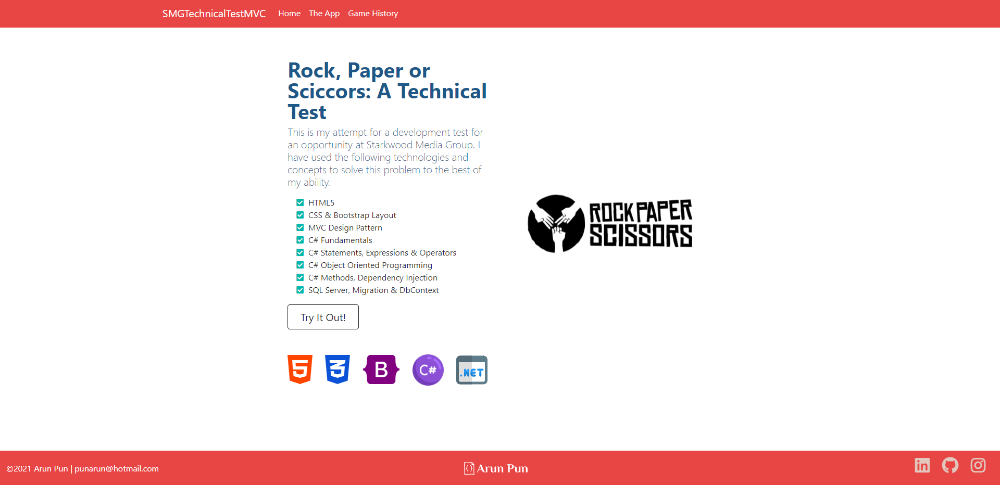
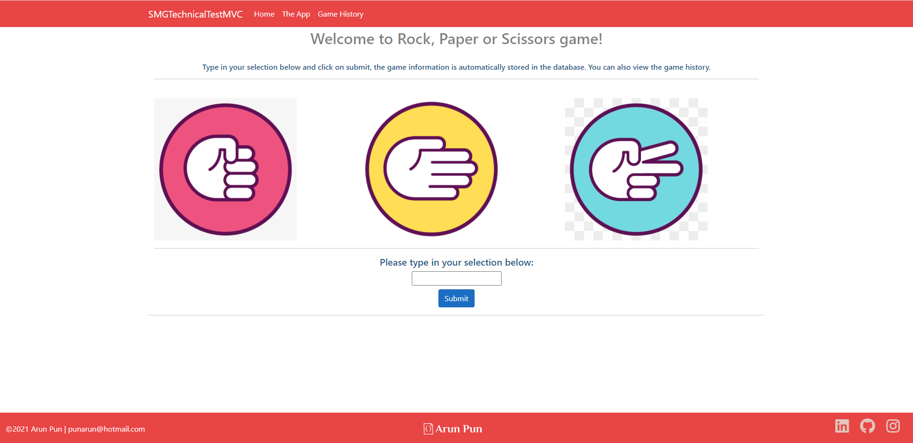
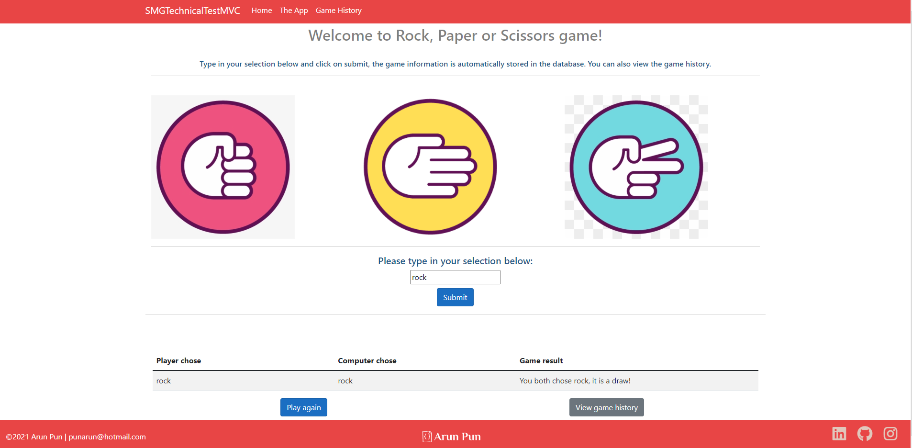
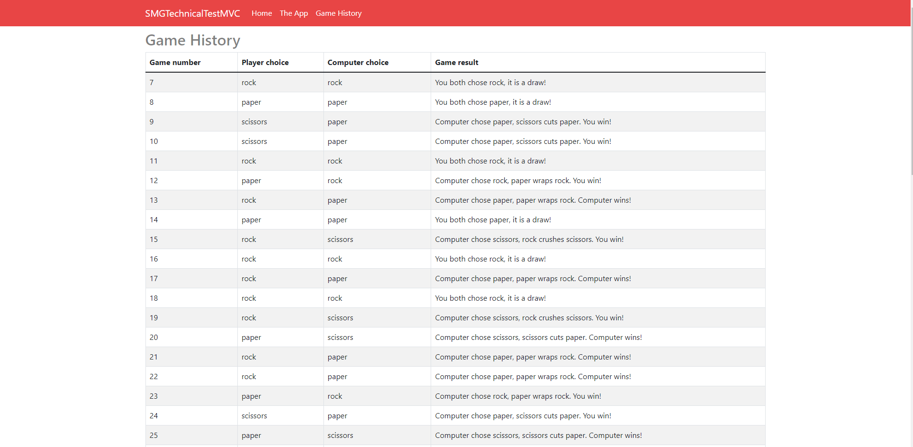
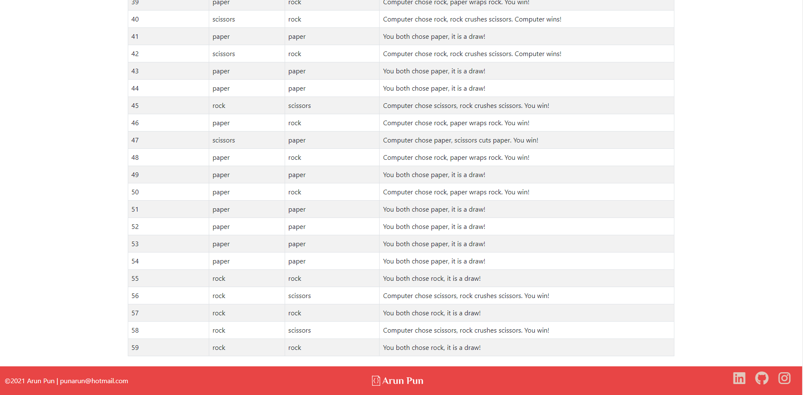

# SMGTechnicalTestMVC - Rock, Paper or Scissors
> Stretch goals
- Store the game history in a live database (SQL Server, MySQL, MongoDB, CosmoDB etc)

## Features
- The user can play the game in a MVC web application
- The user plays against a computer and the results are dynamically rendered
- Each round of game is automatically stored in the database (Please change the 'Server' name on the appsettings.json file 
- The user can track the history of the games played

## Screenshots

## Project Status
Project is : Complete :)

## Room for Improvement

Room for improvement:
- Add validation for user input
- Add search functionality/ability to filter game history
- Customise CSS, make the web app more responsive

## Acknowledgements
Credit to 
- https://github.com/ritaly

## Contact
Created by [@flynerdpl](https://www.flynerd.pl/) - feel free to contact me!

<!-- Optional -->
<!-- ## License -->
<!-- This project is open source and available under the [... License](). -->

<!-- You don't have to include all sections - just the one's relevant to your project -->
